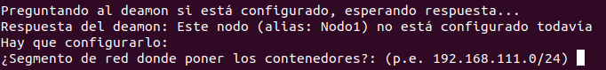
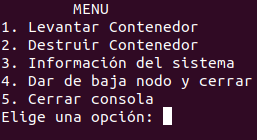
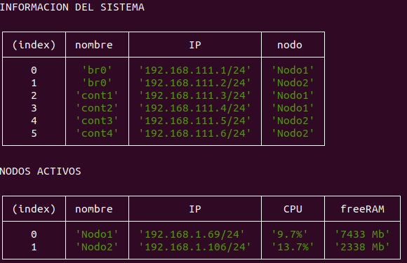
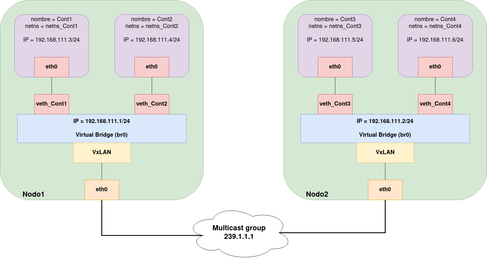

# Construcción de una red Overlay

<!-- RESUMEN -->
Este proyecto consiste en la construcción y configuración de una red overlay
entre contenedores, sobre un cluster cuyos nodos se encuentran en la misma LAN. Utilizando las interfaces de red virtuales disponibles en el núcleo de Linux, así como el framework [Netfilter](https://www.netfilter.org/), los contenedores que se lancen a partir de esta
aplicación podrán comunicarse entre ellos como si estuviesen en la misma red de nivel 2.


<!-- INDICE -->
## Tabla de contenidos

1. [Instrucciones para el despliegue](#instrucciones)  
    1.1. [Pre-requisitos](#instrucciones/pre-requisitos)  
    1.2. [Instalación](#instrucciones/instalacion)  
    1.3. [Despliegue](#instrucciones/despliegue)  
2. [Cómo usar la Consola](#consola)
3. [Configuración de red](#red)  
    3.1. [Alcance de los contenedores](#red/alcance)  
    3.2. [Esquema general](#red/esquema)  
    3.3. [Interfaces de red virtuales](#red/interfaces)  
    3.4. [Reglas de encaminamiento](#red/reglas)  
    3.5. [Netfilter con IPTABLES](#red/iptables)
4. [Generalización del despliegue](#generalizacion)
5. [Implementación con Node.js](#implementacion)
6. [Diagrama de conexiones con ZeroMQ](#conexiones)

___
<!-- COMO USAR -->

## 1. Instrucciones para el despliegue <a name="instrucciones"></a>

***Para poder visualizar el comportamiento de la red *overlay* se recomienda disponer de un mínimo de dos nodos.***

### 1.1. Pre-requisitos <a name="instrucciones/pre-requisitos"></a>

Este *software* está pensando para ser ejecutado sobre un sistema operativo Linux. Además, es necesario tener instaladas las siguientes aplicaciones:

* [Docker Engine](https://docs.docker.com/engine/install/)
* [Docker CLI](https://docs.docker.com/engine/reference/commandline/cli/)
* [Node.js](https://nodejs.org/en/)
* [NPM](https://www.npmjs.com/)

### 1.2. Instalación <a name="instrucciones/instalacion"></a>

<!-- Poner una casilla para clonar el repositorio -->

Una vez clonado el repositorio en alguno de los nodos del cluster, hay que instalar las dependencias del código de **Node.js**. Ejecuta los siguiente comandos en la terminal:

```bash
cd Servidor/

npm install

cd ../Nodo

npm install
```

Este proceso ha de repetirse por cada uno de los nodos que vayan a participar en el cluster,
con la salvedad de que no es necesario descargar ni instalar la parte del **Servidor** más que
en un único nodo.

### 1.3. Despliegue <a name="instrucciones/despliegue"></a>

#### Servidor

Una vez elegido cual de los nodos va actuar como servidor, hay que ponerlo en marcha. Lo primero es levantar un contenedor con **etcd**, que es una base de datos *clave-valor* de la que va a hacer uso el servidor para la gestión de las direcciones IP de los contenedores. Dentro de la carpeta `Servidor`, ejecutar:

```bash
./etcdServer_launcher.sh
```
Este pequeño *script* lanza un contenedor **Docker** con la base de datos **etcd**, exponiendo el puerto 2379, que es el que por defecto se utiliza para acceder a su API.

Para poner en marcha el servidor se ejecuta el siguiente comando:

```
node servidor.js [puertoRep] [puertoPub] [puertoPull]
```

Por defecto:

* puertoPub = 8080
* puertoRep = 8081
* puertoPull = 8082

No se recomienda cambiar el valor de los puertos que expone el servidor, salvo que se tenga en cuenta cuando se configuren los nodos.

#### Nodo <a name="apartadoNodo"></a>

Con el servidor en marcha, se ha de dar de alta a los nodos que participarán en el cluster. Dentro de la carpeta `Nodo`, ejecutar:

```
node deamon.js <Nombre Nodo> <IP servidor>
```

El programa *deamon.js* contacta con el servidor para darse de alta otorgando su nombre y su dirección IP (internamente el programa extrae la dirección IP del nodo). Si el nodo ya está registrado por el servidor (se comprueba la IP del nodo), este lo expulsará.

Una vez el nodo se haya registrado, y esté *deamon* ejecutándose en el *background*, se puede abrir la consola:

```
node contman.js
```

El programa *contman.js* o **consola** es la API del cluster. Se trata de un menú interfaz por terminal que permite la gestión de los contenedores del cluster. La primera vez que se acceda a la consola, se pondrá en contacto con el *deamon* del nodo para configurarlo. Se le pedirá al usuario el segmento de red en el que se situarán los contenedores que se levanten en ese nodo.

Una vez se tiene el nodo configurado, se puede navegar por las diferentes opciones del menú. Además, se puede abrir y cerrar la consola a voluntad para hacer las configuraciones necesarias, ya que es solamente una interfaz, no tiene estado. En la [Sección 2](#consola) se encuentra una explicación detallada del uso de la consola.

Es necesario repetir los pasos de este [apartado](#apartadoNodo) por cada nodo que se quiera dar de alta en el cluster.

Si has seguido los pasos de la instalación hasta este punto, ya tienes todo listo para hacer uso de la aplicación, enhorabuena!


<!-- COMO USAR LA CONSOLA -->
## 2. Cómo usar la Consola <a name="consola"></a>

<!-- Configuración -->

La primera vez que se ejecuta el *deamon* en el nodo, este se da alta en el cluster, pero no configura el entorno hasta que se entra en la consola. Es por ello, que la primera vez que se entre a la consola, esta te pedirá el segmento de red donde poner los contenedores, como se puede ver en la imagen que se encuentra a continuación:




<!-- Menú -->

Una vez completado el paso anterior, la consola presentará un menú interfaz como el que se puede ver en la siguiente imagen:



Explicación de cada una de las opciones:

1. **Levantar Contenedor**. Se presenta al usuario una tabla con los nombres de los objetos (contenedores o *bridges* virtuales) que tienen asociada una dirección IP de la red *overlay*, así como el nombre del nodo en donde se encuentran. A patir de esta información se le pedirá al usuario que elija el nodo y el nombre del contenedor que se quiere levantar.

2. **Destruir Contenedor**. Se presenta al usuario una tabla con los nombres de los contenedores activos en el cluster (similar al caso anterior). El usuario debe escribir el nombre del contenedor que se quiere tumbar.

3. **Información del sistema**. Se proporciona al usuario información en tiempo real de los contenedores activos en el cluster, su dirección IP y el nodo en el que se encuentran. Además, se muestra en una tabla separada los nodos que están dados de alta (es posible que no tengan asociado ningún contenedor), así como las métricas más relevantes (CPU y RAM) para que el usuario pueda hacerse una idea del grado de ocupación de un nodo, y, eligir de manera óptima dónde desplegar el siguiente contenedor. Las métricas de los nodos se actualizan cada 10 segundos.

4. **Dar de baja nodo y cerrar**. Esta opción comunica al sistema todos los objetos que va a eliminar (contenedores y *bridge*) para que se liberen las direcciones IP de la base de datos. A continuación, tumba todos contenedores que tiene asociados y elimina toda la configuración de red. Tras esta operación, el nodo está dado de baja del cluster y con un estado igual al de antes de configurarse.

5. **Cerrar consola**. Cerrar la consola no altera en absoluto al nodo o al cluter, como se ha dicho antes, el programa *contman.js* carece de estado, por tanto, cerrar la consola únicamente corta la comunicación con el *deamon*. Si en algún momento se cierra la consola, se puede abrir nuevamente y el sistema se encontrará en el mismo estado en el que se dejó en un punto anterior (siempre que no se haya accedido al sistema con otra consola desde otro nodo).

<!-- Información del sistema -->



<!-- CONFIGURACIÓN RED -->

## 3. Configuración de red <a name="red"></a>

### 3.1. Alcance de los contenedores <a name="red/alcance"></a>

En esta sección se explica cómo el programa implementa la configuración de red de los contenedores para que sean capaces de comunicarse entre ellos como si estuviesen en el mismo segmento de red a nivel 2, sobre una comunicación física a nivel 3.

Antes de entrar en el detalle de la configuración, cabe destacar que cada uno de los contenedores es capaz de establecer comunicación con:

* Contenedores que se encuentren en el mismo nodo.
* El nodo que ejerce como host del propio contenedor.
* Cualquier otro nodo del cluster
* Cualquier otro contenedor del cluster que se encuentre en un nodo distinto al propio.
* Con internet (si es que el nodo en el que se encuentra puede hacerlo).

### 3.2. Esquema general <a name="red/esquema"></a>

A continuación, se presenta un esquema orientativo de la configuración de red que se encuentra en cada uno de los nodos, suponiendo que tienen dos contenedores activos:



Todo contenedor se sitúa dentro de un *Network Namespace*, en su interior se encuentra uno de los extremos de la interfaz de red virtual *VETH*, a la que se le asocia una dirección IP del segmento de red elegido. El otro extremo de la interfaz *VETH* se encuentra en el *Network Namespace* del host, conectado a una interfaz *bridge*. Por otro lado, desde la interfaz de red física del host (*eth0*), se crea una interfaz *VxLAN*, que también se conecta al *bridge*. Esta configuración es análoga para cada nodo miembro del cluster, una vez se ha configurado.

### 3.3. Interfaces de red virtuales <a name="red/interfaces"></a>

Utilizando el paquete [iproute2](https://es.wikipedia.org/wiki/Iproute2) se puede, de manera sencilla, administrar las interfaces de red y conexiones de las que dispone el núcleo de Linux:

* **Virtual ETHernet** (VETH). Es una virtualización de una conexión ethernet local. Se crea a pares, y es usualmente utilizada para comunicar *Network Namespaces*. Comando para crear un par de interfaces *VETH*:

```
ip link add <veth_edge1> type veth peer name <veth_edge2>
```

* **Linux Bridge**. Es una virtualización de un dispositivo *switch*. Todos los paquetes que le llegan los resparte entre todas las interfaces conectadas a él. Comando para crear un *bridge* y conectarle interfaces:

```
ip link add <name> type bridge
ip link set <if_name> master <bridge_name>
```

* **VxLAN**. Es un dispositivo que utiliza el protocolo de tunelización para enmascarar paquetes de nivel 2 sobre paquetes UDP-IP. Para esta aproximación se ha utilizado la virtualización que permite formar un grupo *multicast* para que el descubrimiento de nuevas interfaces entre nodos se haga de forma dinámica. Esto permite que el dispositivo *VxLAN* actúe como ***Proxy ARP***, es decir,que cuando le lleguen paquetes del grupo *multicast* con direcciones IP de las cuales él conozca las direcciones MAC, las pueda responder. Para crear esta interfaz de red virtual, en la configuración que se ha discutido se ha de ejecutar el siguiente comando:

    * **VNI**: Identificador de la red VxLAN
    * **Group**: Dirección IP para formar el grupo *multicast* por el que se comunicaran los distintos *VTEP* (*VxLAN Tunnel End Point*) pertenecientes a la misma VxLAN, para realizar el descubrimiento dinámico de direcciones MAC.


```
ip link add <name> type vxlan id <VNI> dstport <port> group <address> dev <host_if> ttl <number>
```


### 3.4. Reglas de encaminamiento <a name="red/reglas"></a>

Para que los contenedores sean capaces de comunicar con su propio host, y viceversa, es necesario añadir un par de reglas de encaminamiento:

* En el host, al asignarle una dirección IP al *bridge* (dentro del *Network Namespace* del host), este puede utilizar este dispositivo como *gateway* para comunicarse con toda la red *overlay*.

```
<overlay_subnet> dev <bridge_name> proto kernel scope link src <bridge_address>
```

* Dentro del *Network Namespace* del contenedor.

```
default via <bridge_address> dev eth0 src <cont_address>
```

### 3.5. Netfilter con IPTABLES <a name="red/iptables"></a>

Para que los contenedores sean capaces de comunicarse con el resto de nodos pertenecientes a la LAN, así como, para establecer comunicación con internet, es necesario el empleo de ***Network Address Translator*** (***NAT***). De igual manera que los *routers* emplean esta técnica para comunicar los dispositivos de una LAN con los de otra LAN (tanto por motivos de seguridad como por escased de IPv4), si se quiere establecer comunicación desde dentro de un contenedor con el exterior del nodo, este último ha de actuar como *router*.

Por tanto, la regla que hay que añadir a la tabla de **NAT** de **IPTABLES** (en la cadena de *POSTROUTING*), es la siguiente:

```
iptables -t nat -A POSTROUTING -s <overlay_subnet> -o <host_if> -j MASQUERADE
```

Por defecto, **Docker Engine** modifica la política de la cadena de *FORWARD* tomando la acción de *DROP*. Esto provoca que ninguna interfaz de red que se encuentre en el *Network Namespace* del host sea capaz de redirigir paquetes. La solución más trivial es cambiar esta politica a *ACCEPT* (también se podrían poner reglas específicas que permitan la redirección a un cierto segmento de red):

```
iptables -t filter -P FORWARD ACCEPT
```


<!-- GENERALIZACIÓN -->

## Generalización del despliegue <a name="generalizacion"></a>

<!-- DIAGRAMAS DE FLUJO -->

## Implementación con Node.js <a name="implementacion"></a>

<!-- DIAGRAMAS DE CONEXIONES -->

## Diagrama de conexiones con ZeroMQ<a name="conexiones"></a>